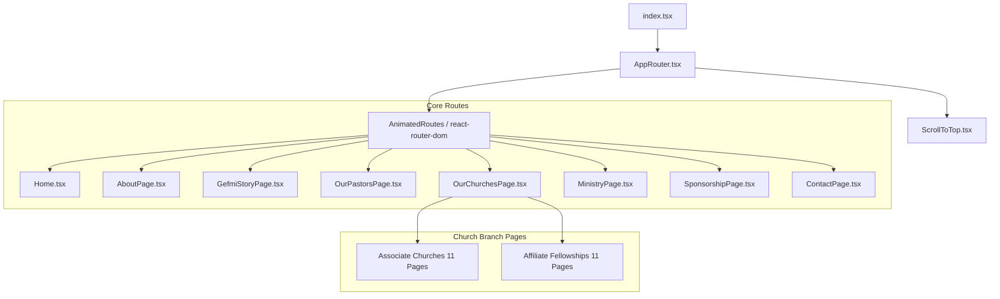

# GEFMI Antigravity Website Analysis

This document provides a detailed architectural, technical, and structural analysis of the **GEFMI (Gospel East Fellowship Ministries International)** React website.

---

## 🗺️ Architectural Overview

The website is a modern, high-performance, single-page application (SPA) built with a premium aesthetic and rich interactive animations. 



### Key Technologies
*   **Framework**: [React 18](https://react.dev) (TypeScript support enabled).
*   **Routing**: [React Router DOM v6](https://reactrouter.com) with custom route-level exit/enter transitions.
*   **Animations**: [Framer Motion](https://www.framer.com/motion/) for fluid, momentum-based scrolling, fade-ins, sliding page transitions, and interactive modals.
*   **Styling**: [Tailwind CSS v3](https://tailwindcss.com) utilizing custom color palettes, CSS keyframes, and responsiveness tokens.
*   **Icons**: [Lucide React](https://lucide.dev) for highly consistent vector iconography.
*   **Scroll Management**: Custom Lenis-style smooth momentum-scroll hook `useSmoothScroll` that manages physics-based inertia for mouse wheels and touch inputs.

---

## 📁 Codebase Directory Structure

The structure of the `src/` folder is cleanly divided by concerns:

```
src/
├── App.tsx                 # Base entry layout component (renders Home)
├── AppRouter.tsx           # Global Router containing all route definitions & transitions
├── index.css               # Global Tailwind CSS configurations & keyframe animations
├── index.tsx               # Main DOM renderer wrapping the AppRouter in StrictMode
├── components/             # Reusable UI elements & page section layout blocks
├── contexts/               # React Context Providers for global states (e.g., Loading states)
├── hooks/                  # Custom React hooks (smooth scroll physics)
└── pages/                  # Main page entry points and subfolder for affiliate churches
```

---

## 🛠️ Components Breakdown

There are **21 core components** that power the modularity and design system of the website:

| Component | Purpose / Description |
| :--- | :--- |
| **`Navbar.tsx`** | A floating, sticky header with dynamic scroll transparency, custom logo placement, and an animated mobile overlay menu. |
| **`Footer.tsx`** | Standardized bottom section displaying links, contact information, social handles, and copyright data. |
| **`Hero.tsx`** | Layout container for full-screen entry banners. |
| **`HeroCarousel.tsx`** | Framer Motion carousel rotating prominent announcement slides with fluid progress meters. |
| **`LoadingScreen.tsx`** | A premium transition screen shown on page load, rendering custom logo animations and rotating scripture readings. |
| **`AboutSection.tsx`** | An interactive overview of the ministry’s vision, mission, head pastor, and expansion statistics. |
| **`ServicesSection.tsx`** | Renders schedule options, live stream radio times, and weekly service listings. |
| **`SponsorshipSection.tsx`**| Call-to-action block highlighting areas of financial support and community development. |
| **`AffiliateChurchTemplate.tsx`** | Reusable structural layout for affiliate church pages. |
| **`AffiliateFellowshipTemplate.tsx`** | Reusable structural layout for regional fellowship hub pages. |
| **`BackButton.tsx`** | Custom navigation trigger returning users safely to prior pages. |
| **`Button.tsx`** | Standardized, themed UI button supporting multiple variant styles (solid, outline, gradients). |
| **`Container.tsx`** | Width-constraining wrapper to ensure layout consistency across monitor sizes. |
| **`PhoneLink.tsx` & `EmailLink.tsx`** | Accessible action components for parsing and launching local communication clients. |
| **`ContactButtons.tsx`** | Floating or inline action group aggregating rapid dial and messaging services. |
| **`ScrollToTop.tsx`** | Listens to routing events and snaps the viewport back to coordinate `(0,0)` on page transition. |
| **`SectionIndicator.tsx`** | Side bar or header navigation indicator tracking active scroll positions. |
| **`SmoothScrollGuide.tsx` & `SmoothScrollDemo.tsx`** | Visual guidelines and demos illustrating the custom scroll physics. |
| **`VideoBackground.tsx`** | Background element rendering HTML5 loops underneath hero sections. |

---

## 📄 Pages & Routing Analysis

The application contains **30 individual page views** partitioned by organizational structures.

### 1. Main Hubs
*   **`Home.tsx`**: Combines the Carousel, Services, About, and Sponsorship sections into a unified smooth-scroll workspace.
*   **`AboutPage.tsx`**: Renders comprehensive breakdowns of GEFMI history, its timeline, leadership details, and youth divisions.
*   **`GefmiStoryPage.tsx`**: Provides a deep textual review of the SEC registration in 2004, the founding director Rev. PrinceBen C. Hernandez, and early church plants.
*   **`MinistryPage.tsx`**: Explains weekly programs, community services, education, and kids' ministries.
*   **`SponsorshipPage.tsx`**: Multi-tiered partner page highlighting 4 key giving fields (Building Fund, Ministry Support, Church Planting, General Fund) with transparent metrics.
*   **`ContactPage.tsx`**: Displays direct address, telephone numbers, and email action cards.

---

### 2. Leadership & Pastors Page (`OurPastorsPage.tsx`)
Features a tabbed layout detailing the lives and callings of the pastoral network:
*   **Head Pastor & Founder**: Rev. Movel B. Velasco.
*   **11 Associate Pastors**: Servicing primary locations (e.g., Ptr. Lando Abalos, Ptr. Jerry Nobres, Ptr. Rudy Tindaan, Ptr. Moris Velasco, Ptr. Vergilio Lamsis, etc.)."remove jether"
*   **12 Fellowship / Affiliate Pastors**: Representing network alliances (e.g., Ptr. Leonard Clemens Cadoy, Ptr. Louie Silan, Ptr. Sonny Jacob, Ptra. Gina Espiritu, etc.).

---

### 3. Church Networks Directory (`OurChurchesPage.tsx`)
A tabbed portal separating **Associate Churches** from **Affiliate Fellowships**:

#### ⛪ Associate Churches (GEFMI-Founded)
Each church has its own custom-built subpage under `src/pages/` containing local service times, direct Facebook group links, maps, and specific image galleries:
1.  **Bantinan Church** *(Mother Church - Est. 2015/1992)*: [BantinanChurch.tsx](file:///d:/GEFMI-antigrav/src/pages/BantinanChurch.tsx)
2.  **Beti Church** *(Est. 2016)*: [BetiChurch.tsx](file:///d:/GEFMI-antigrav/src/pages/BetiChurch.tsx)
3.  **Aasin Church** *(Est. 2017)*: [AasinChurch.tsx](file:///d:/GEFMI-antigrav/src/pages/AasinChurch.tsx)
4.  **Lower Kiskis Church** *(Est. 2018)*: [LowerKiskisChurch.tsx](file:///d:/GEFMI-antigrav/src/pages/LowerKiskisChurch.tsx)
5.  **Upper Kiskis Church** *(Est. 2018)*: [UpperKiskisChurch.tsx](file:///d:/GEFMI-antigrav/src/pages/UpperKiskisChurch.tsx)
6.  **Tactac Orchids Evangelical Church** *(Est. 2019)*: [OrchidsChurch.tsx](file:///d:/GEFMI-antigrav/src/pages/OrchidsChurch.tsx)
7.  **Villaflores Christian Fellowship Center** *(Est. 2020)*: [VillafloresChurch.tsx](file:///d:/GEFMI-antigrav/src/pages/VillafloresChurch.tsx)
8.  **Timmuri Church** *(Est. 2021)*: [TimmuriChurch.tsx](file:///d:/GEFMI-antigrav/src/pages/TimmuriChurch.tsx)
9.  **Dalton Church**: [DaltonChurch.tsx](file:///d:/GEFMI-antigrav/src/pages/DaltonChurch.tsx)
10. **Atbu Church**: [AtbuChurch.tsx](file:///d:/GEFMI-antigrav/src/pages/AtbuChurch.tsx)
11. **Santa Fe Church**: [SantaFeChurch.tsx](file:///d:/GEFMI-antigrav/src/pages/SantaFeChurch.tsx)

#### 🤝 Affiliate Church Fellowships (Partners)
These are independent works associated with the GEFMI network, located under the `src/pages/affiliate/` path:
*   **LHGCF (Living Hope and Grace in Christ Fellowship)**:
    *   *Putlan Church* (Carranglan, Nueva Ecija) — Ptr. Nora Silan / Ptra. Rocelyn Basilio
    *   *Ikapito Church* (Carranglan, Nueva Ecija) — Ptr. Roselyn Basilio / Ptr. Carlito Sanchez
    *   *Manicla Church* (Carranglan, Nueva Ecija) — Ptr. Louie Silan
    *   *Bambang Church* (Nueva Vizcaya) — Ptr. Clem
*   **Psalms 23**:
    *   *Psalms 23 Church* (Bambang, Nueva Vizcaya)
*   **CTL (Christ The Lord Fellowship - Aurora Province)**:
    *   *Calaocan Church* — Ptr. Sonny Boy
    *   *Toytoyan Church* — Ptra. Merly
    *   *Borlongan Church* (Dipaculao, Aurora) — Ptr. Teodoro Garlit Sr.
    *   *Baler Church* — Ptr. Joseph Soridor

---

## ⚡ Custom Scroll Mechanics (`useSmoothScroll.ts`)

A standout technical aspect of the codebase is the custom smooth-scroll hook. Instead of relying on raw CSS or heavy external libraries, it utilizes a custom physics simulation:
*   **Momentum Boost**: Compounds speed on consecutive wheel scrolling.
*   **Frame-Rate Normalization**: Calculates `deltaTime` to ensure identical scroll deceleration on 60Hz, 120Hz, or 144Hz monitors.
*   **Deceleration Decays**: Emulates iOS touch momentum inside browser viewports.
*   **Responsive Bounds**: Automatically adjusts maximum scrolling indices on window resizing.

---

## 🎨 Premium Visual Elements

The website establishes its brand identity with a high-end look and feel:
*   **Typography**: Google Font **Poppins** is set globally to establish clean headings and modern copy layout.
*   **Curated Palettes**: Avoids harsh primaries; instead relies on deep warm colors (`amber-600` to `orange-700` gradients) for the mother church, cool technology gradients (`blue-600` to `cyan-600`), and organic shades (`emerald-500` to `teal-500`) for partnership associations.
*   **Glassmorphism**: Combines `backdrop-blur-md` with transparent borders (`border-white/10` and `border-white/20`) to create floating elements over dynamic background gradients.
